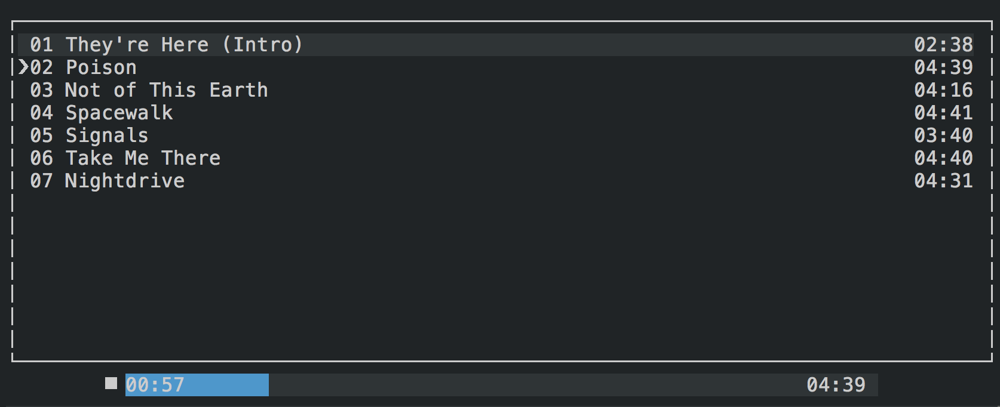

## River CLI

Hacked together a simple music streaming client to stream my home library.

### Requirement:

  * Node.js
  * [MPV](https://mpv.io/) media player

### Server
  The backend is just any web server to serve music files and a `meta.json`
  that is generated by the [river-gen program](https://github.com/rspi/river-gen).
